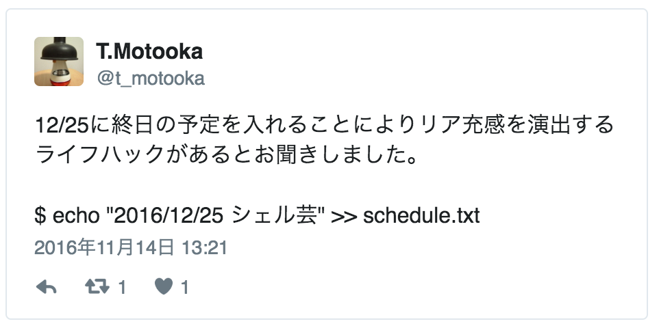
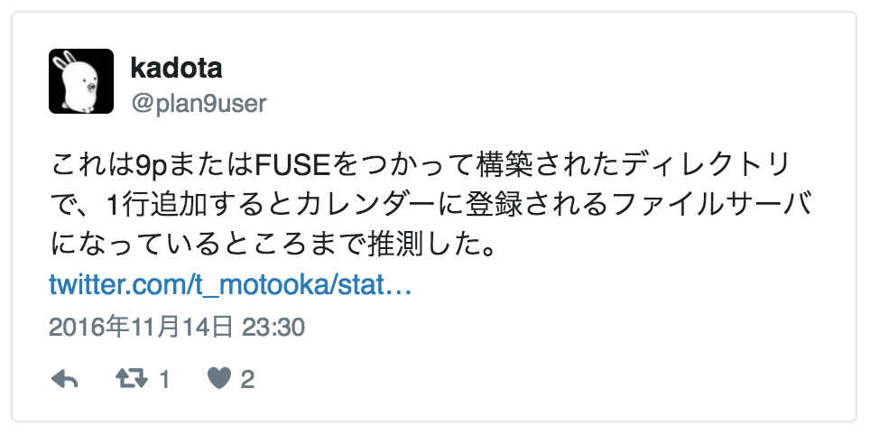

# FUSE で繋がる世界

### 第 26 回シェル芸勉強会 大阪サテライト LT
### 2016/12/25
### so

>>>

Powered by
* [reveal.js](https://github.com/hakimel/reveal.js/)
* [GitHub Pages](https://horo17.github.io/calfs-slide/)

>>>

## `$ whoami`


* so
* インフラエンジニア (AWS)
* Twitter: @3socha

---

## FUSE とは

* Filesystem in Userspace
* VFS (仮想ファイルシステム) 機能を提供するインタフェース
* ユーザ独自のファイルシステムを作成できる
* 9P (Plan 9 Filesystem Protocol) 由来

>>>

## 普通のファイルシステム

* カーネル空間で動作する
* ファイルシステム毎にカーネル内に処理するコードがある
* ドライバをロードしたり、カーネルを再構築する必要がある

>>>

## FUSE を利用したファイルシステム

* 一般のアプリケーションと同じ、ユーザ空間で動作する
* 様々なファイルシステムを手軽に、安全に扱うことができる
* ユーザが拡張しやすい

---

## FUSE の利用例

* procfs
    * Linux の `/proc` にマウントされ、動作中のプロセスの情報を提供
* sshfs
    * SSH で接続先したリモートホストのディレクトリをローカルにマウント
* s3fs / goofys
    * Amazon S3 をサーバにマウント
* NTFS-3G
    * Mac OS X から BootCamp の Windows 領域を操作
* GmailFS
    * Gmail 上のメールとしてファイルを保存

>>>

## FUSE の利用方法

* まずライブラリをインストール

### RHEL/CentOS

```sh
# yum install fuse
```

### macOS

* FUSE for macOS

>>>

## マウント

* macOS での例

### sshfs でリモートホストをマウント

```sh
$ mkdir /local/mountpoint
$ sshfs user@host:/remote/mountpoint /local/mountpoint
```

### アンマウント

```sh
$ diskutil unmount /local/mountpoint
```

---

## ところで、つい先日のこと

[](https://twitter.com/t_motooka/status/798018023537815552)

>>>

## ほう...

[](https://twitter.com/plan9user/status/798171280163930113)

>>>

## カレンダー FS を実装してみる

* 各言語用のライブラリがあるので、好きな言語で
* 今日は Ruby 2.4 のリリース日なので、今回は Ruby

* FUSE
    * Gem: rfusefs
* カレンダー
    * Google カレンダー
    * Gem: google-api-client

>>>

## 実装

```ruby
require 'rfusefs'

class CalFS < FuseFS::FuseDir

    def direcotry?(path)
        # ...
    end

    # ...
end
```

* インタフェースは 30 種類程度
* 必要なもののみ実装
    * contents
    * file?
    * directory?
    * read_file

>>>

## マウント

```ruby
FuseFS.set_root(CalFS.new)
FuseFS.mount_under(dirname)
FuseFS.run
```

* カレンダー部分は省略
* OAuth 認証のあたりは注意

>>>

## 利用例

* あの予定いつやったっけ
    * `find`
* リスケ
    * `mv`
* キャンセル
    * `rm`
* 時間変更...
    * `sed`

---

## FUSE の楽しい世界

* [ファイルシステムでズンドコキヨシ - Qiita](http://qiita.com/rryu/items/272c08a4eae68d627151)

```sh
$ mkdir zundoko
$ ./zundoko_fs.rb zundoko &
$ find zundoko
$ kill %1
```

>>>

## FUSE で繋がる世界

* [GoでFUSEを使ってGitHubのIssuesをマウントする - Qiita](http://qiita.com/lufia/items/7719dcf5c49b2c5c8d8d)
* ネタを振ってくれた人の AC
* 何を言っているのk (ry

---

## まとめ

* FUSE で様々なものをシェル芸の餌食にできる可能性
* ちょっと危険
    * 各 I/F がどのタイミングでどれだけ呼び出されるかは理解しておいた方が良さそう
